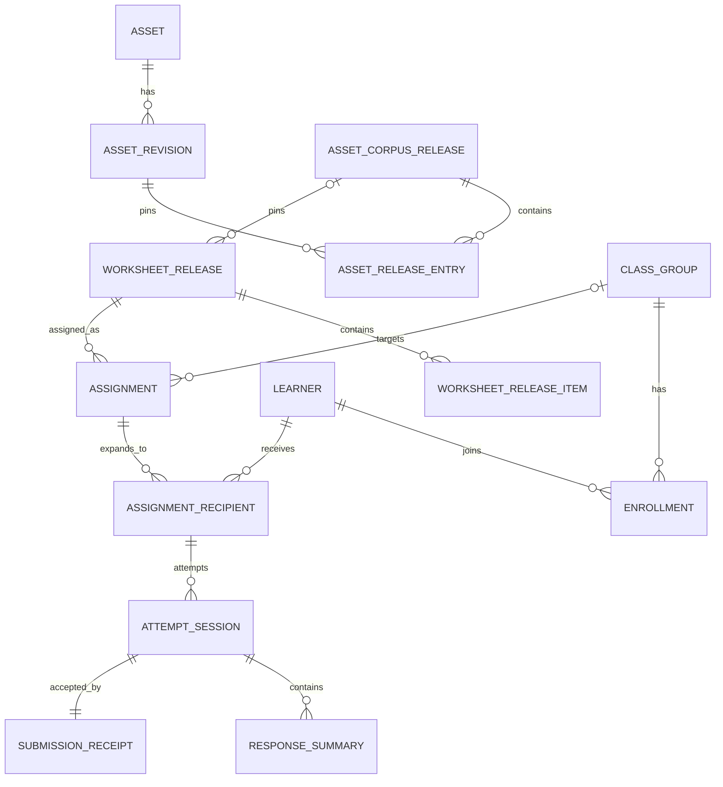

# 운영 데이터 모델과 관측 가능성

이 문서는 digi-mon의 자산, 학습지 발급, 배정, 풀이 세션과 응답 요약을
지속적으로 저장할 때의 운영 계약을 정의한다. 현재 엔진은 결정적으로 학습지를
생성하고 응답 기록을 반환하지만 저장하지 않는다. 따라서 아래 내용은 **구현할
저장 계층의 설계**이지 현재 런타임이 이미 제공하는 기능에 대한 설명이 아니다.

설계는 세 단계를 명확히 나눈다.

- **개인정보 최소 파일럿:** 교사 한 명, 한 기기. DB 없이 발급한 worksheet payload를
  파일로 내보내고, 답안은 저장하지 않으며 활성 세션의 익명 집계만 메모리에 둔다.
- **로컬 내구성 단계:** 교사가 작업을 다시 열어야 한다는 관찰이 반복될 때만
  SQLite와 로컬 파일을 추가한다. 저장 범위는 worksheet release와 만료가 짧은 익명
  세션 집계로 제한한다.
- **기관 배포:** 여러 학교·교사·기기. 중앙 서비스, PostgreSQL, 객체 저장소,
  인증·권한·감사·동기화를 추가한다.

파일럿과 로컬 내구성 단계에 다중 tenant, 분산 queue, Kubernetes, 데이터 웨어하우스를 미리
넣지 않는다. 반대로 기관 배포에서 shared `TEACHER_TOKEN`, 공유 SQLite 파일,
클라이언트 시각이나 애플리케이션 필터만으로 tenant를 분리하지 않는다.

## 1. 의미와 비목표

### 1.1 보존할 불변식

1. `worksheet fingerprint`는 내용 동일성 검사다. 발급자 인증, 만료, 재전송
   방지 또는 부정행위 방지 서명이 아니다.
2. 발급한 학습지는 당시의 worksheet JSON과 corpus·asset release identity를
   함께 고정한다. 이후 엔진으로 같은 seed를 재생성할 수 있으리라 가정하지 않는다.
3. 자산 blob과 revision은 내용 주소화하고 덮어쓰지 않는다. 회수는 과거 내용을
   조용히 바꾸는 대신 상태와 가용성을 바꾼다.
4. 제출은 `clientSubmissionId`로 멱등하다. 네트워크 재시도가 응답 수를 늘리지
   않는다.
5. 운영 저장소에는 학습자가 제출한 자유 서술 원문을 기본 저장하지 않는다.
   문항별 `answered`, `correct` 또는 `null`, 제한된 수행 시간과 수동 루브릭의
   boolean 판정만 저장한다.
6. 집계는 원본 운영 레코드에서 재생성할 수 있는 파생 데이터다. 집계값을 원본처럼
   수정하지 않는다.

`worksheet release`는 한 번 발급되어 내용이 고정된 학습지다.
`asset corpus release`는 승인 자산 revision의 불변 manifest다. 둘은 다른
수명주기와 ID를 사용한다.

### 1.2 해석 한계

이 데이터는 수업 운영과 연습 결과의 **설명적 요약**에 사용한다.

- `accuracy`는 저장된 자동 채점 응답 중 정답 비율이다. 숙달도, 능력, 학습 장애,
  진단 결과가 아니다.
- `declaredDifficulty`는 문항 설계자가 정한 수준이다. 검증된 심리측정 척도가 아니다.
- 짧은 시간, 무응답, 반복 시도는 동기, 지식 또는 부정행위의 증거가 아니다.
- 성취기준별 낮은 비율은 교사가 검토할 연습 신호다. 학생 분류, 진급, 배치 또는
  고위험 의사결정을 자동화하지 않는다.
- 표본이 작은 집단의 비율, 교사·학급 순위, 예측 점수, 개인 프로파일은 제공하지
  않는다. Rasch/IRT, DIF, 적응형 진단은 별도의 타당화와 운영 승인이 없는 한
  범위 밖이다.

## 2. 단계별 구성

| 관심사 | 로컬 내구성 단계 | 기관 규모 |
|---|---|---|
| 관계형 저장소 | 앱 전용 SQLite, WAL, 단일 writer | 관리형 PostgreSQL, `tenant_id`, connection pool |
| blob | 앱 데이터 디렉터리의 SHA-256 경로 | versioning이 켜진 private 객체 저장소 |
| 사용자 | 로컬 교사 capability, 학습자 계정·안정 ID 없음 | OIDC/SAML 교직원, roster 연동 또는 기관 가명 ID |
| 권한 | OS 계정과 앱 경계 | tenant RBAC, DB row-level security, service identity |
| 오프라인 | 한 기기에서만 검증된 로컬 흐름. network sync 없음 | 제한된 encrypted client store와 outbox/inbox sync |
| queue | 없음. 유지보수는 명시적 로컬 작업 | transactional outbox + 작업자 + dead-letter |
| 분석 | SQLite query로 교사용 설명적 요약 | 비식별·최소화된 집계 read model |
| 관측 | 구조화 로컬 로그, health 화면, DB 점검 | 중앙 metric/log/trace, audit sink, alerting |
| 백업 | SQLite online backup + blob manifest | PITR DB + 객체 versioning + 교차 장애영역 복제 |

로컬 DB와 blob은 source tree나 `out/` 안이 아니라 OS의 앱 데이터 디렉터리에
둔다. 저장소 checkout을 백업 또는 운영 DB로 사용하지 않는다.

## 3. 논리 모델

모든 ID는 애플리케이션에서 생성하는 불투명 UUIDv7 또는 동등한 128-bit ID다.
가명 learner ID, 외부 roster ID와 내부 기본키를 혼용하지 않는다. 모든 시각은
UTC instant로 저장하고 UI에서만 지역 시각으로 표시한다. 기관 단계의 모든
업무 테이블에는 아래 표에서 생략한 `tenant_id`가 있으며 기본키 또는 고유
인덱스에 포함한다.



### 3.1 공통 열 계약

변경 가능한 레코드는 `created_at`, `updated_at`, 정수 `row_version`을 가진다.
기관 단계에서 갱신은 `WHERE row_version = ?`인 낙관적 동시성 제어를 사용한다.
작성 주체가 중요한 레코드는 `created_by_actor_id`를 가진다. 삭제 정책이 있는
레코드는 임의의 `deleted` boolean 대신 `deleted_at`, `deletion_reason`을
사용한다.

정규화된 상태 enum은 DB `CHECK`와 애플리케이션 계약 양쪽에서 검증한다.
확장 가능한 보조 metadata만 JSON으로 두며, 검색·권한·보존·관계 무결성에 쓰는
값은 정규 열로 둔다.

기관 단계의 identity 경계는 `tenant`, `actor`, `tenant_membership` 세 테이블로
분리한다. `actor`는 외부 subject와 직접 개인정보가 아닌 내부 ID를 연결하고,
`tenant_membership(tenant_id, actor_id, role, valid_from, valid_until)`이
`teacher`, `reviewer`, `tenant_admin`, `auditor` 권한을 부여한다. 인증 성공만으로
어느 tenant에도 접근할 수 없으며 모든 request는 하나의 활성 membership을
선택해야 한다. platform operator는 tenant membership을 묵시적으로 갖지 않는다.
service identity도 actor와 구분하고 허용된 job과 tenant scope만 부여한다. 로컬
내구성 단계에는 이 테이블들을 넣지 않고 하나의 local teacher actor 상수만 사용한다.

### 3.2 자산 DB

자산 조달의 상세 검토 상태와 provenance는
[`asset-procurement.md`](asset-procurement.md)를 따른다. 운영 모델은 그 계약을
다음과 같이 저장한다.

| 테이블 | 핵심 열과 제약 |
|---|---|
| `asset` | `asset_id` PK, `kind`, `title`, `language`, `grade_band`, `status`; 논리 자산 계열 |
| `asset_revision` | `revision_id` PK, `asset_id` FK, `blob_sha256`, `bytes`, `mime`, `source_kind`, `status`, `supersedes_revision_id`; `(asset_id, revision_id)`와 digest 불변 |
| `asset_generation_job` | `job_id` PK, `asset_spec_key`, `profile_id`, `prompt_template_sha256`, `input_sha256`, `provider_request_id` nullable, `status`, `attempt_count`, `cost_minor` nullable, `created_at`, `finished_at`; active `(asset_spec_key, profile_id)` idempotency |
| `asset_generation_attempt` | `job_id`, `attempt_no`, `started_at`, `finished_at`, `outcome`, `error_code`, `output_sha256` nullable; provider 원문·prompt 본문은 운영 로그에 저장하지 않음 |
| `asset_topic_mapping` | `revision_id`, `topic_id`, `state`, `confidence`, `note`; 승인과 후보 분리 |
| `asset_review` | `review_id`, `revision_id`, `domain`, `reviewer_actor_id`, `decision`, `evidence_ref`, `reviewed_at`; append-only |
| `asset_corpus_release` | `release_id` PK, `manifest_sha256` UNIQUE, `issued_at`, `status`; 발행 후 불변 |
| `asset_release_entry` | `release_id`, `ordinal`, `asset_spec_key`, `asset_id`, `revision_id`, `blob_sha256`; release 내 ordinal과 revision UNIQUE |
| `asset_recall` | `recall_id`, `revision_id`, `reason_code`, `effective_at`, `serve_action`, `recorded_by`; append-only |
| `blob_object` | `sha256` PK, `bytes`, `mime`, `storage_key`, `availability`, `verified_at`; 내용은 DB 밖 CAS에 저장 |

생성 job은 학습자 요청과 분리된 조달 제어면만 쓴다. 제한된 재시도 뒤 영구 실패는
`failed`/dead-letter 상태로 남기고 운영자가 새 job으로 재개한다. 공급자 응답으로
revision을 만들 때 job, model/profile, 입력·출력 digest lineage를 연결한다.
로컬 자산 내구성 단계에 실제 생성 worker가 없으면 이 두 job 테이블도 만들지 않는다.

발행 트랜잭션은 승인된 revision만 정렬된 release entry에 넣고 manifest digest를
검증한 뒤 release를 한 번에 `published`로 만든다. 발행된 행은 UPDATE/DELETE를
금지한다. revision 회수 시 신규 선택을 막고 blob을 `available`, `quarantined`,
`deleted` 중 하나로 표시한다. 삭제된 blob을 필요로 하는 과거 요청은
`ASSET_REVISION_UNAVAILABLE`로 실패하며 동일 콘텐츠를 재현했다고 주장하지
않는다.

### 3.3 학습지 발급

| 테이블 | 핵심 열과 제약 |
|---|---|
| `worksheet_release` | `worksheet_release_id` PK, `worksheet_schema`, `engine_version`, `fingerprint`, `seed`, `options_json`, `corpus_integrity`, `asset_corpus_release_id` nullable, `payload_sha256`, `issued_at`, `issued_by_actor_id`; `(fingerprint, payload_sha256)` 검증 |
| `worksheet_release_item` | `worksheet_release_id`, `ordinal`, `item_id`, `generator_id`, `standard_code`, `declared_difficulty`, `format`, `scoring`, 자산 참조 nullable; `(release_id, ordinal)` PK |
| `worksheet_payload` | `payload_sha256` PK/FK `blob_object`; 정답 포함 canonical teacher artifact |

item 열은 조회·참조 무결성에 필요한 최소 index다. canonical worksheet JSON은
중복 정규화하지 않고 digest가 검증된 blob으로 보존한다. 학습자에게는 payload를
직접 주지 않고 기존 answer/spec 제거 로직을 적용한 projection만 제공한다.

현재 `worksheet@2`에는 asset corpus identity가 없다. 자산 연결 전에는 nullable로
두되 자산을 참조한 item이 하나라도 있으면 worksheet 차기 주 버전과 함께
`asset_corpus_release_id`, manifest digest와 item의 asset revision/digest를
필수화하고 fingerprint 입력에 포함한다.

발급된 payload는 엔진 업그레이드 뒤 재생성 결과로 교체하지 않는다. 보존 기간 중
채점은 저장한 payload와 fingerprint를 사용한다. payload가 없거나 회수된 자산
때문에 사용할 수 없으면 명시적으로 실패하고 조용히 최신 문항으로 바꾸지 않는다.

### 3.4 roster, 배정과 대상 - 기관 단계에서만

| 테이블 | 핵심 열과 제약 |
|---|---|
| `learner` | `learner_id` PK, `pseudonym`, `display_alias` nullable, `status`; 이름·이메일 기본 금지 |
| `class_group` | `class_group_id` PK, `label`, `school_year`, `archived_at` |
| `enrollment` | `class_group_id`, `learner_id`, `joined_at`, `left_at`; 기간 중복 방지 |
| `assignment` | `assignment_id` PK, `worksheet_release_id` FK, `class_group_id` nullable, `title`, `opens_at`, `due_at`, `closes_at`, `attempt_limit` nullable, `status`, `row_version` |
| `assignment_recipient` | `assignment_id`, `learner_id`, `assigned_at`, `withdrawn_at`; 배정 시점의 대상 snapshot |

`assignment_recipient`는 현재 enrollment를 매번 join한 동적 결과가 아니다.
학급에서 나간 학생의 과거 제출이 다른 학생에게 귀속되거나, 새 학생에게 과거
과제가 묵시적으로 생기는 일을 막는다. 개인 배정도 같은 테이블을 사용한다.

파일럿과 로컬 내구성 단계에는 이 다섯 테이블을 만들지 않는다. 익명 세션 집계만
필요하면 재시작 시 폐기되는 session-local 식별자만 사용한다. 실명 roster가 꼭
필요한 기관은 목적·보존·접근·삭제·동의 경계를 먼저 승인하고 별도 identity/roster
영역에 암호화해 보관하며, 운영·분석 테이블에는 내부 `learner_id`만 전달한다.

### 3.5 세션, 제출과 응답 요약 - 기관 단계에서만

| 테이블 | 핵심 열과 제약 |
|---|---|
| `attempt_session` | `session_id` PK, `assignment_id`, `learner_id`, `attempt_no`, `started_at` nullable, `submitted_at`, `server_received_at`, `status`; recipient FK, `(assignment_id, learner_id, attempt_no)` UNIQUE |
| `submission_receipt` | `client_submission_id` UNIQUE, `session_id` UNIQUE, `payload_digest`, `received_at`, `result_digest`; 멱등 응답 재사용 |
| `response_summary` | `session_id`, `item_ordinal`, `item_id`, `generator_id`, `standard_code`, `subject`, `grade_band`, `declared_difficulty`, `format`, `scoring`, `answered`, `correct` nullable, `elapsed_ms` nullable; `(session_id, item_ordinal)` PK |
| `manual_criterion_result` | `session_id`, `item_ordinal`, `criterion_ordinal`, `met`; 자유 서술 note 없음 |
| `session_summary` | `session_id` PK, `auto_graded`, `answered`, `correct`, `manual_pending`, `completion_rate`, `accuracy`, `computed_with_version`; 재생성 가능한 projection |

한 제출을 다음 순서의 단일 트랜잭션으로 처리한다.

1. `client_submission_id`를 조회한다. 이미 있으면 저장된 결과를 반환한다.
2. assignment 대상·기간·attempt 정책과 worksheet fingerprint를 검증한다.
3. 저장한 worksheet payload로 채점한다.
4. session, receipt, item별 summary와 수동 criterion boolean을 함께 insert한다.
5. 같은 트랜잭션에서 outbox/aggregate 갱신 신호를 기록하고 commit한다.

현재 `/v1/grade`의 `responseRecords` 계약과 맞춰 `correct`는 수동 채점 또는
채점 불가능 항목에서 `null`일 수 있다. 원래 답안, 정규화된 답안, 오답 선택지,
교사의 자유 서술 note는 저장하지 않는다. 제품 요구로 원문 저장이 생기면 별도
민감 데이터 저장소, 명시적 목적·보존 기간·접근 감사·삭제 절차를 먼저 승인하고
기본 모델에는 추가하지 않는다.

`elapsed_ms`는 클라이언트가 보낸 제한된 보조 정보다. 음수·무한대·정책상 최대값
초과를 거부하며 능력이나 행동을 추론하는 데 사용하지 않는다. `started_at`과
client event time은 참고값이고 attempt 순서와 마감 판정은 서버가 받은 시각을
기준으로 한다.

## 4. 상태와 쓰기 소유권

| 엔터티 | 상태 전이 | 쓰기 소유자 |
|---|---|---|
| asset revision | procurement 문서의 단방향 상태 기계 | 조달 제어면 |
| asset corpus release | `draft -> published -> retired` | release publisher |
| worksheet release | `issued -> retired`; 내용 불변 | worksheet service |
| assignment | `draft -> open -> closed -> archived` | 교사/assignment service |
| attempt session | `submitted -> graded`, 또는 `submitted -> manual-pending -> graded`; 결과 정정은 새 revision event | submission service와 승인된 교사 |

`archived`, `retired`, `closed`는 삭제가 아니다. 법적·정책상 삭제는 별도 deletion
workflow가 수행하고 audit에 최소 tombstone을 남긴다. 과거 결과를 수정해야 할 때
기존 summary를 UPDATE하지 않고 `grading_revision`과 정정 이유를 남긴 뒤 최신
projection을 다시 계산한다. 로컬 내구성 단계에서는 수동 정정 UI가 생길 때까지 이 추가
테이블을 만들 필요가 없다.

## 5. 개인정보, 보안과 보존

### 5.1 데이터 분류

| 등급 | 예 | 처리 |
|---|---|---|
| 공개/배포 가능 | 승인 asset release manifest, 공개 curriculum code | 무결성 검증, 권리 조건 준수 |
| 내부 | 생성 옵션, 운영 metric, generator 집계 | 인증된 교사/운영자만 |
| 학생 관련 | learner 가명, 배정, session, response summary | 암호화, 최소 권한, 보존·삭제 적용 |
| 비밀 | token, OIDC credential, encryption key | DB 금지, secret store/OS credential store |
| 제한 콘텐츠 | 정답 포함 worksheet, 회수·격리 asset | 학습자 projection과 분리, 접근 감사 |

로그, trace, metric label, crash report와 analytics export에는 이름, alias,
`learner_id`, assignment title, 자유 서술, bearer token, request/response body를
넣지 않는다. 고카디널리티 ID는 trace attribute 대신 권한 있는 audit 조회에서만
사용한다.

로컬 DB와 backup은 OS 계정 권한으로 제한한다. 가능한 배포 환경에서는 volume
또는 DB 파일 암호화를 사용하되, 암호화가 접근 통제를 대신하지 않는다. 기관
단계는 전송 중 TLS, 저장 시 관리형 암호화와 별도 key rotation 정책을 적용한다.

### 5.2 기본 보존표

실제 기관은 관할 법률, 계약과 학교 정책 검토 후 기간을 설정해야 한다. 아래는
제품의 과도한 영구 보존을 막는 **초기 기본값**이며 법률 준수 주장이나 법률
자문이 아니다.

| 데이터 | 로컬 내구성 단계 기본 | 기관 기본 제안 | 삭제 방식 |
|---|---:|---:|---|
| active learner/class/enrollment | 저장하지 않음 | 기관 roster 정책, 기본 종료 + 90일 | identity link 삭제 후 tombstone |
| assignment/session/response summary | 학습자 연결 없는 익명 집계만, 기본 30일 이내 | 수업연도 종료 + 365일 이내 | learner link 및 item-level 행 삭제 |
| raw submitted answer | 저장하지 않음 | 저장하지 않음 | 해당 없음 |
| worksheet release/payload | 마지막 연결 assignment 삭제 + 90일 | 결과 재현·이의 기간과 동일 | 참조 없을 때 payload 삭제, 최소 digest 보존 |
| 운영 application log | 14일 | 30일 | 자동 만료 |
| 보안/audit log | 90일 | 365일 또는 승인된 정책 | append-only store 만료 |
| 로컬 backup | 최근 7일 daily + 4주 weekly | PITR 35일 + 월별 12개 예시 | 암호화 세대 만료 |
| 후보·격리 asset | 90일 | 조달/권리 정책 | CAS 참조 검사 후 삭제 |
| 발행 asset metadata | 권리·provenance 정책 | 권리·provenance 정책 | blob 삭제 가능, 최소 recall metadata 보존 |

삭제 job은 live DB만 지우지 않는다. 다음 backup 만료 시점, 객체 version 삭제,
검색/집계 projection 정리와 완료 시점을 deletion receipt에 기록한다. legal hold가
있으면 일반 삭제를 멈추되 hold 범위·승인자·해제 시각을 감사한다. 사용자는 UI에서
현재 정책과 예정 삭제일을 볼 수 있어야 한다.

기관 analytics는 운영 ID를 salt가 분리된 단기 분석키로 치환한다. 분석 목적이
끝나면 링크 테이블을 먼저 삭제한다. 작은 셀은 기본 `n < 10`에서 숨기고, 다른
필터 조합으로 개인을 역추론할 수 있는 drill-down을 제공하지 않는다.

## 6. 로컬과 오프라인

### 6.1 로컬 내구성 단계

SQLite 설정은 `foreign_keys=ON`, WAL mode, 적절한 `busy_timeout`을 사용한다.
HTTP process 하나만 writer이고 분석·backup은 read connection을 사용한다.
네트워크 파일시스템이나 동기화 폴더의 SQLite를 여러 프로세스가 공유하지 않는다.

이 단계는 한 기기에서만 로컬로 동작한다. 자동 cloud sync를 가장하지 않으며,
여러 학습자 기기가 같은 교실망에서 동작한다는 의미로 “완전 오프라인”을 주장하지
않는다. 기기 이동은 검증된 암호화 export/import 또는 전체 restore다. 두 DB의
양방향 merge는 지원하지 않으며 import는 새 빈 store 또는 명시적인 중복 검사
경로에만 허용한다.

### 6.2 기관용 offline sync

오프라인이 실제 요구가 될 때만 client store를 추가한다. 서버가 원장이며 sync는
일반적인 DB 복제가 아니라 제한된 operation protocol이다.

- 클라이언트는 `device_id`, `operation_id`, `entity_id`, `base_row_version`,
  `operation_type`, schema version과 payload digest를 encrypted outbox에 기록한다.
- ID는 offline에서 생성할 수 있다. 서버는 `(tenant_id, operation_id)`를 UNIQUE로
  두고 같은 operation의 재전송에 같은 결과를 반환한다.
- 제출 operation은 append-only이고 자동 merge하지 않는다. 동일
  `client_submission_id`는 하나, 다른 ID는 attempt 정책에 따라 별도 시도 또는
  명시적 conflict가 된다.
- assignment 편집은 `base_row_version`이 맞을 때만 적용한다. 불일치하면 서버
  상태와 conflict를 돌려 교사가 선택하게 한다. last-write-wins를 사용하지 않는다.
- roster 삭제·접근 철회와 asset recall은 우선순위가 높은 tombstone으로 내려가며
  stale client가 데이터를 되살릴 수 없다.
- 서버는 tenant별 단조 증가 `change_sequence`와 opaque cursor를 제공한다.
  client는 적용한 cursor를 transactionally 저장하고 재접속 때 이어받는다.
- `client_occurred_at`은 표시용이다. 권한, 마감, 보존과 audit 순서는
  `server_received_at` 및 sequence를 사용한다.
- client에는 배정된 학습자 projection과 필요한 worksheet만 최소 기간 cache한다.
  교사용 정답 payload와 다른 학급 데이터는 learner device에 배포하지 않는다.
- offline credential은 기기별, 짧은 수명, 회수 가능해야 한다. logout·기기 분실·
  enrollment 철회 시 key와 cache를 지운다.

오래 offline이어서 worksheet가 회수되거나 과제가 닫힌 경우 서버는 제출을 조용히
수락하지 않는다. 정책별 `ASSIGNMENT_CLOSED`, `ASSET_RECALLED`,
`CLIENT_SCHEMA_UNSUPPORTED` conflict와 교사 처리 경로를 반환한다.

## 7. 백업과 복구

### 7.1 로컬 내구성 단계 runbook

1. SQLite online backup API 또는 검증된 `VACUUM INTO` 방식으로 일관된 snapshot을
   만든다. 실행 중 DB/WAL 파일을 단순 복사하지 않는다.
2. snapshot, 참조되는 blob 목록, 각 SHA-256, app/schema version, 생성 시각을
   하나의 manifest에 기록한다.
3. 암호화한 뒤 운영 데이터와 다른 물리 위치에 저장하고 `latest` 한 개가 아니라
   세대별로 회전한다.
4. backup 후 SQLite `integrity_check`, manifest digest와 blob 존재를 검사한다.
5. 적어도 분기마다 임시 앱 데이터 디렉터리에 restore하고 worksheet 열기,
   assignment 조회, 과거 session summary 재계산을 실제로 수행한다.

기본 목표는 RPO 24시간, RTO 4시간이다. 이를 보장한다고 표시하기 전에 restore
측정값을 남긴다. backup 실패가 36시간을 넘거나 마지막 restore 검증이 120일을
넘으면 health 화면에 경고한다.

### 7.2 기관 배포

- PostgreSQL continuous backup/PITR과 최소 두 장애영역 복제를 사용한다.
- 객체 저장소는 versioning, retention, inventory/digest 검사를 사용한다.
- DB snapshot과 객체 inventory의 공통 backup epoch를 기록한다. DB만 복원되어
  blob이 없는 상태를 성공으로 보지 않는다.
- tenant 단위 export/delete와 전체 재해복구를 별도 runbook으로 시험한다.
- 제안 초기 목표는 RPO 15분, RTO 4시간이며 실제 부하·비용·기관 요구로 승인한다.
- backup 접근, restore와 key 사용은 모두 audit event다. production에 restore하기
  전 격리 환경에서 migration과 digest 검증을 통과시킨다.

## 8. 스키마와 데이터 migration

`schema_migration(version, name, checksum, applied_at, app_version, duration_ms)`를
원장으로 둔다. 이미 적용한 migration 파일의 checksum이 바뀌면 시작을 거부한다.
운영 DB를 앱 시작 때 암묵적으로 destructive migrate하지 않는다.

### 8.1 로컬 내구성 단계 절차

1. 시작 전 online backup과 여유 디스크를 확인한다.
2. 앱이 지원하는 `from_version`인지 확인한다. 너무 오래된 DB는 단계별 upgrade를
   요구한다.
3. 작은 DDL/data migration은 `BEGIN IMMEDIATE` transaction에서 실행한다.
4. 큰 backfill은 resumable cursor와 progress table을 사용하고 reader를 오래
   막지 않는다.
5. foreign key, row count, digest와 도메인 invariant를 검사한 뒤 version을 올린다.
6. 실패하면 transaction rollback 또는 backup restore를 수행한다. down migration에
   의존하지 않는다.

SQLite에서 table rebuild가 필요한 migration은 새 table 생성, 변환 insert,
검증, rename 순서로 수행한다. 사용자 데이터 손실을 허용하는 fallback은 없다.

### 8.2 기관용 무중단 절차

expand/migrate/contract를 서로 다른 release로 나눈다.

1. **Expand:** nullable 열·새 테이블·동시 호환 index를 추가한다.
2. **Dual compatibility:** 새 앱은 구·신 shape를 읽고 하나의 명확한 writer가 새
   shape를 쓴다. 무기한 dual-write하지 않는다.
3. **Backfill:** tenant/range별 bounded batch, checkpoint와 검증 query로 이동한다.
4. **Cutover:** read path를 새 shape로 바꾸고 mismatch metric이 0인지 확인한다.
5. **Contract:** 이전 app version이 모두 빠진 뒤 구 열과 호환 코드를 제거한다.

index는 가능한 online/concurrent 방식으로 만들고 lock timeout을 둔다. migration은
schema version, rows examined/changed, duration, retry, validation failure를 metric으로
남긴다. worksheet/grading JSON 계약의 주 버전 정책은
[`schema-versioning.md`](schema-versioning.md)를 별도로 따른다. DB migration과 API
contract version을 같은 숫자로 묶지 않는다.

## 9. 분석 read model

운영 화면은 다음의 제한된 요약만 제공한다.

- 발급·배정·제출·완료 건수
- 자동 채점 가능한 응답의 `attempts`, `correct`, `accuracy`
- `answered / assigned_items`인 completion rate
- generator·성취기준·선언 난이도별 표본 수와 설명적 비율
- 현재 `MIN_SAMPLES` 미만이면 비율 대신 “표본 부족”
- 반복 시도 포함/첫 시도만/최신 시도 정책을 화면과 export에 명시
- 수동 문항은 자동 정확도에서 제외하고 evaluated criterion count를 별도 표시

집계 grain은 명시적으로 version한다. 예:

```text
response_daily_v1(
  tenant_or_local_scope, day, subject, grade_band, standard_code,
  generator_id, declared_difficulty, attempt_policy,
  responses, answered, auto_graded, correct
)
```

로컬에서는 필요할 때 SQL로 계산하고 데이터가 커진 뒤에만 materialized table을
추가한다. 기관에서는 outbox event로 집계를 갱신하되 운영 행과 매일 reconciliation
한다. late offline submission은 원래 client 날짜가 아니라 별도
`received_day`로도 집계해 숫자 변경 이유를 설명한다.

대시보드 문구는 “저장된 연습 응답”, “자동 채점 항목”, “표본 수”를 표시한다.
“숙달”, “진단”, “능력”, “위험 학생”, “예상 성취”를 근거 없이 사용하지 않는다.
원시 learner-level analytics export는 기본 제공하지 않는다.

## 10. 관측 가능성

### 10.1 신호와 상관관계

모든 요청/작업은 무작위 `request_id` 또는 `trace_id`를 가진다. 비동기 경계에는
`operation_id`/`job_id`를 전달한다. `learner_id`, 토큰, 제출 본문을 correlation
ID로 사용하지 않는다.

구조화 application log의 허용 필드는 다음과 같다.

```text
at, level, service, version, environment, request_id, trace_id,
route_template, method, status_class, duration_ms, error_code,
tenant_hash(기관만), db_operation, rows, job_type
```

URL query, authorization header, body, response payload, assignment title와 사용자
agent 전체 문자열은 기록하지 않는다. 예상 가능한 domain rejection은 안정된
error code와 4xx로 기록하고 stack trace를 남기지 않는다. 예상 밖 5xx는 stack을
남기되 local path와 secret을 redaction한다.

기관 단계의 distributed trace는 HTTP -> DB/outbox -> worker -> object store 경계를
연결한다. response body와 SQL bind value는 span에 넣지 않는다. 로컬 내구성 단계는 동일한
필드의 JSON line log와 관리자 health 화면이면 충분하며 별도 telemetry backend를
요구하지 않는다.

### 10.2 최소 metric

| 영역 | metric 예 | label 제한 |
|---|---|---|
| HTTP | request count, latency histogram, 4xx/5xx | route template, method, status class |
| 발급 | worksheet issued/failed, shortfall, fingerprint conflict | subject, grade band, error code |
| 제출 | accepted, duplicate, conflict, grading latency | scoring mode, error code; learner ID 금지 |
| 저장 | DB latency/error, WAL size, connection wait, DB/blob bytes | operation class |
| sync | outbox depth/age, operation conflict, cursor lag, tombstone apply | client version bucket |
| asset | cache hit/miss, digest failure, unavailable revision, recall apply lag | asset kind, release ID는 log에만 |
| backup | last success age, bytes, duration, restore verification age | backup class |
| migration | current version, duration, rows, validation failure | migration name/version |
| privacy | deletion queue age, rows deleted, backup expiry pending | reason class; subject ID 금지 |
| analytics | projection lag, reconciliation mismatch | projection version |

`item_id`, `assignment_id`, `asset_id`, `tenant_id`처럼 cardinality가 계속 증가하는
값을 metric label로 사용하지 않는다.

### 10.3 SLI와 초기 alert

초기 목표는 실제 사용량을 관찰한 뒤 승인한다. 다음 조건은 실용적인 시작점이다.

- 로컬 health: DB write 실패 즉시 표시, 마지막 backup 36시간 초과 경고,
  `integrity_check` 실패 critical.
- 기관 API: 5분간 비의도 5xx 비율 1% 초과, p95 제출 처리 2초 초과 경고.
- sync: 가장 오래된 outbox operation 15분 초과 또는 dead-letter 증가 경고.
- asset: digest mismatch 1건도 critical, published revision unavailable 즉시 경고.
- backup: 예정 backup 2회 연속 실패 또는 restore 검증 120일 초과 경고.
- privacy: 승인된 deletion SLA 초과, stale offline client의 삭제 대상 재업로드 시도
  즉시 조사.
- projection: 운영 원장과 집계 mismatch가 허용된 late-event window 이후 0이
  아니면 경고.

낮은 학습자 정답률, 특정 학생의 무응답 또는 빠른 제출은 운영 alert가 아니다.
관측 시스템이 교육적 판단을 자동 incident로 바꾸지 않는다.

### 10.4 audit event

일반 application log와 별도로 다음은 append-only audit에 남긴다.

- 교직원 login 실패/성공, role·tenant membership 변경
- 정답 포함 worksheet 또는 제한 콘텐츠 조회
- assignment 발행·회수·정정
- 수동 criterion 판정과 결과 정정
- roster import/export, learner data export/delete, legal hold
- asset 승인·발행·회수, blob 격리/삭제
- backup restore, migration, retention policy 변경
- secret/key 관리 작업의 결과(비밀 값 자체 제외)

필드는 `event_id`, `occurred_at`, `actor_type/id`, `tenant_id`, `action`,
`target_type/id`, `outcome`, `reason_code`, `request_id`, `prev_digest`, `digest`다.
로컬은 회전 파일 또는 DB append-only table과 연속 digest로 우발적 변경을 탐지한다.
기관은 쓰기 권한이 분리된 audit sink와 보존 정책을 사용한다. hash chain은 접근
통제나 외부 서명을 대신하지 않는다.

## 11. 기관 배포로 넘어가는 기준과 순서

다음 중 하나가 실제 요구가 되면 로컬 경계를 확장한다.

- 두 명 이상의 교사가 같은 roster·assignment를 동시에 편집한다.
- 여러 기기의 제출을 합쳐야 한다.
- 중앙 계정 회수, 기관 감사, tenant별 삭제/export가 필요하다.
- 로컬 RPO/RTO로 감당할 수 없는 운영 중요도가 생긴다.

권장 전환 순서:

1. 현재 JSON 계약과 위 논리 모델로 repository interface를 정의하고 로컬 SQLite를
   구현한다.
2. summary-only 저장, 멱등 제출, retention purge, backup/restore를 한 교사
   환경에서 검증한다.
3. actor, tenant, RBAC와 중앙 PostgreSQL을 추가한다. 모든 query에 tenant 경계를
   integration test하고 DB RLS로 이중화한다.
4. 관리형 blob, transactional outbox, 중앙 관측·audit을 추가한다.
5. 실제 offline 요구가 확인된 surface에만 operation/cursor sync를 추가한다.
6. 분석 사용자가 생긴 뒤 최소 집계 read model을 추가한다. 운영 DB의 학생 행을
   범용 warehouse로 그대로 복제하지 않는다.

기관의 tenant 삭제는 업무 행, identity link, 객체, projection, search index와
backup expiry를 하나의 추적 가능한 workflow로 처리한다. super-admin의 교차 tenant
조회는 기본 거부하고 긴급 접근은 사유, 시간 제한과 audit을 요구한다.

## 12. 로컬 내구성 단계 완료 조건

교사가 작업을 다시 열지 못해 파일럿 흐름이 반복해서 중단됐다는 관찰이 있을 때만
이 단계를 시작한다. 첫 persistence increment는 다음을 모두 만족할 때 완료다.

- 새 앱 데이터 디렉터리에 migration으로 SQLite DB를 생성한다.
- 발급 당시 worksheet payload와 fingerprint를 저장하고 같은 내용을 다시 열 수 있다.
- 학습자·학급·enrollment·recipient·개별 attempt 테이블은 만들지 않는다.
- 저장이 필요하면 학습자 연결이 없는 session aggregate만 두고 짧은 TTL로 자동
  삭제한다. 제출 원문과 item별 elapsed time은 저장하지 않는다.
- teacher-owned worksheet export와 한 가지 restore 경로를 실제 빈 디렉터리에서
  검증한다.
- schema version과 migration checksum을 검사하고 중간 실패가 rollback된다.
- health와 log가 DB 상태를 알리되 답안, token, alias 또는 식별자를 기록하지 않는다.

이 단계에는 asset generation queue, CAS revision ledger, cloud sync, roster, 실명,
OIDC, warehouse, 예측 분석 또는 심리측정 모델이 포함되지 않는다.
