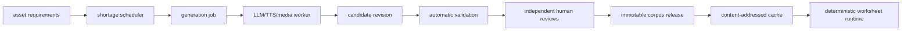

# digi-mon 후속 개선 울트라리서치

> 기준 커밋: `694721b`
>
> 연구일: 2026-08-08 UTC (기준 커밋 작성일은 2026-08-09 KST)
>
> 범위: 현재 구현을 유지하면서 다음에 투자할 개선 순서
>
> 산출물: Markdown 원본, PDF, DOCX

## 1. 결론

digi-mon은 현재 **결정적 문항 생성·연습 엔진**으로서는 강한 기반을 갖췄다.
그러나 아직 교정된 심리측정 평가, 학년 적합성이 승인된 영어 어휘 체계,
음성·지문·매체 코퍼스 또는 학습자 진단 시스템은 아니다.

다음 투자는 아래 순서가 가장 타당하다.

1. **후보 의미 정렬 리뷰 큐**
2. **로컬 asset manifest와 revision hash MVP**
3. **작은 구조화 매체 코퍼스 pilot**
4. **최소 증거중심설계(ECD) 메타데이터와 보수적 결과 문구**
5. **표본 수·불확실성을 포함한 설명적 telemetry**
6. **문항 lifecycle과 선택지·오개념 telemetry**
7. **근거 구간을 포함한 짧은 국어 지문 pilot**
8. **권리·발음·접근성 검토가 준비된 뒤 음성/TTS pilot**

배포·인증·전체 산출물 스키마 검증은 모든 단계에 적용하는 교차 guardrail로 둔다.

반대로 다음은 지금 하지 않는 편이 낫다.

- 학습자 요청 중 LLM/TTS 실시간 생성
- 학습자 데이터 없이 IRT·Rasch·DIF 또는 “숙달도” 주장
- 800개 영어 어휘의 자동 학년군 배정
- 54개 수행 기준을 객관식 프록시로 자동 커버
- 사용자가 확정되기 전 전체 QTI/CASE 플랫폼 구현
- 콘텐츠가 하나도 없는 상태에서 대규모 DB·오브젝트 스토리지·큐 구축

## 2. 연구 기준선

| 항목 | 현재값 | 해석 |
|---|---:|---|
| 전체 성취기준 | 248 | 수학 121, 국어 87, 영어 40 |
| 생성기 | 193 | 검산·난이도·용량 게이트 통과 |
| 자동채점 가능 기준 | 194 | 자동채점 불가 54개는 별도 |
| 자동채점 커버리지 | 150/194 | 44개가 자산·내용 때문에 미충족 |
| 승인 의미 정렬 | 119/248 | 실제 승인된 `assesses` topic |
| 후보 의미 정렬 | 151/248 | 승인 전 후보 포함 |
| 수학 자동채점 커버리지 | 118/120 | 2개는 실제 작도·도형 만들기 |
| 공식 초등 권장 영어 대표 표제어 | 800 | 학년군 배정표가 아님 |
| 프로젝트 선택 영어 seed | 54 | 전문가 학년 적합성 승인이 아님 |
| 자산 요구 | 44 | passage 24, media 9, audio 7, procedure 2, dialogue 1, wordlist 1 |

근거 원장은 다음과 같다.

- `data/coverage/coverage.json`
- `src/curriculum/asset-requirements.mjs`
- `data/curriculum/english-official-vocabulary.json`
- `src/curriculum/english-vocab.mjs`
- `src/ontology/alignment.mjs`
- `REVIEW.md`

## 3. 연구 방법

### 3.1 조사 축

- 교육과정 공백과 의미 정렬
- 평가 타당도·난이도·루브릭·공정성
- LLM/TTS 자산 공급망과 캐시/DB
- SVG·음성·CJK 접근성
- 보안·개인정보·CI·출처
- QTI/CASE 등 교육 상호운용성
- 적대적 검토와 과잉 설계 제거
- 공식·표준·1차 외부 출처

보안·상호운용성은 한 연구자가 함께 조사해 8개 조사 축을 7개 독립 subagent에
배정했다. 이 보고서는 저장소 계약 이름은 영문(`worksheet`, `asset`)으로,
일반 개념은 한국어(학습지, 자산)로 표기한다.

### 3.2 증거 규칙

1. 저장소 사실은 코드·스키마·테스트·생성 원장으로 확인했다.
2. 외부 주장은 정부·표준기구·공식 사양·공개 평가 표준을 우선했다.
3. 학습자 데이터가 없으면 난이도·타당도·공정성을 확정하지 않았다.
4. 전문가 검토가 없으면 `candidate`를 `approved`로 올리지 않았다.
5. 자산이 필요한 기준을 텍스트 객관식으로 대체하지 않았다.
6. 새 인프라는 현재 계약으로 해결할 수 없는 문제가 확인된 경우에만 제안했다.

### 3.3 실행상의 한계

네이티브 협업 팀 runner는 두 구성에서 모두 시작 단계 실패를 일으켰다. 연구를
중단하지 않고 동일한 연구 축을 7개 독립 subagent로 전환했다. 이 장애는 연구
내용의 근거 수준과 분리해 저널에 기록했다.

## 4. 우선순위 로드맵

### 4.1 P0 — 후보 의미 정렬 리뷰 큐

#### 의미 정렬 문제

승인 의미 정렬은 119/248이고 후보 정렬은 151/248이다. 차이 32개는 코드가 어떤
성취기준 아래 있다는 사실만으로 세부 평가 주제를 승인할 수 없다는 뜻이다.

#### 리뷰 큐 최소 구현

`data/review/generator-topic-review-queue.json`과 사람이 읽는 Markdown을
결정적으로 생성한다.

필수 필드:

- `generatorId`
- `standardCode`
- `topicId`
- `mappingRole`
- `candidateReason`
- `itemExamples`
- `constructClaim`
- `observableEvidence`
- `proxyRisk`
- `reviewerId`
- `decision`
- `evidence`
- `reviewedAt`

#### 리뷰 큐 완료 조건

- 큐가 생성기·topic 변경 시 freshness 실패
- reviewer와 evidence가 없으면 `approved` 금지
- 한 문항이 여러 주제를 평가하면 자동 추측 금지
- 예시 문항과 성취기준 문구를 함께 검토 가능
- 승인 전후 의미 커버리지 차이를 원장으로 출력

#### 리뷰 큐에서 하지 않을 것

- 웹 관리 화면
- LLM 단독 승인
- 표준 아래 모든 topic 자동 상속

### 4.2 P0 — 로컬 asset manifest/revision hash MVP

#### 자산 재현성 문제

현재 학습지 fingerprint는 엔진·옵션·문항·온톨로지를 묶지만, 미래 자산 revision과
corpus release를 식별하지 않는다. 지문·그림·음성이 들어간 뒤에도 이 상태라면
같은 seed가 다른 자산을 선택할 수 있다.

#### asset manifest 최소 구현

대형 DB보다 먼저 로컬 불변 manifest를 만든다.

```json
{
  "schema": "digi-mon/asset-corpus-release@1",
  "releaseId": "asset-corpus-2026-001",
  "manifestSha256": "...",
  "revisions": [
    {
      "assetId": "ko.passage.center-001",
      "revisionId": "sha256:...",
      "type": "passage",
      "blobSha256": "...",
      "reviewStatus": "approved",
      "accessibility": {
        "lang": "ko",
        "longDescription": null,
        "transcriptRevisionId": null
      }
    }
  ]
}
```

필요한 계약 변화:

- item: 선택적 `assetId`, `revisionId`, `blobSha256`
- worksheet 차기 major: `assetCorpusReleaseId`, `manifestSha256`
- fingerprint: 자산을 쓰는 학습지만 release와 revision을 입력에 포함
- 과거 manifest: 수정 금지
- 회수: 새 release에서 제외하되 과거 지문 해석 정보는 보존

#### asset manifest 완료 조건

- 정렬된 manifest 직렬화와 SHA-256
- 승인 revision만 release 가능
- missing revision은 다른 자산으로 대체하지 않고 fail-closed
- 자산 없는 기존 파라메트릭 생성기는 영향 없음
- corpus 변경 시 fingerprint가 달라지는 회귀 테스트

### 4.3 P1 — 구조화 매체 pilot

#### 구조화 매체를 먼저 하는 이유

구조화 SVG/JSON 장면은 픽셀 이미지보다 검증·접근성·결정성을 보존하기 쉽다.
다만 이미 SVG 렌더러가 있으므로 새 렌더링 프레임워크보다 **작은 승인 코퍼스**가
중요하다.

후보 기준:

- `[4영02-04]`
- `[4영02-05]`
- `[4영02-07]`
- `[6영02-02]`
- `[6영02-05]`

pilot 범위:

- 장면 5~10개
- 허용 표현과 오답이 명확한 장면만
- 구조화 spec과 사람이 검토한 long description
- alt text가 답을 노출하는지 별도 검사
- SVG script·event handler·외부 URL·`foreignObject` 금지

완료 조건:

- JSON Schema와 안전한 렌더링 subset
- 접근 가능한 데이터 표현
- 정답 유일성 검토
- 학년군 어휘 seed 안에서만 표현
- curriculum, language, accessibility 독립 승인

### 4.4 P1 — 최소 ECD 메타데이터

#### ECD 메타데이터 목적

성취기준 연결을 “이 문항이 무엇을 관찰하고 무엇을 추론하는가”까지 확장하되,
심리측정 시스템인 척하지 않는다.

권장 선택 필드:

- `claim`: 관찰하려는 학습자 수행
- `evidenceObserved`: 정답·과정에서 직접 관찰되는 증거
- `taskFeatures`: 수 범위, 문항 형식, 표현 방식, 요구 절차
- `constructIrrelevantRisks`: 읽기 부담, 시각 의존, 배경지식 등
- `accommodationNotes`
- `contentReviewStatus`

이 필드는 traceability와 검토에만 사용한다. latent trait, ability, mastery,
grade-level 또는 diagnosis를 산출하지 않는다.

#### 안전한 결과 문구

- “취약 성취기준” 대신 “추가 연습 후보”
- 표본 수와 문항 범위를 함께 제공
- 자동 문항과 수동 문항 결과 분리
- accommodation·미응답·노출 문항 수를 맥락으로 제공
- 정확도는 숙달도나 학년 수준이 아님을 API 문서에 명시

### 4.5 P1 — 기술적 불확실성 개선

현재 30표본 임계값과 `<0.6` 기준은 운영 heuristic이다. 심리측정 표준이 아니다.

로컬에서 가능한 개선:

- raw accuracy와 함께 Wilson 또는 Beta 구간
- item·generator·standard별 표본 수
- 같은 학습자·세션의 반복 시도 deduplication
- 선택한 보기 telemetry
- 미응답·수동·자동 상태 분리
- “descriptive only” 계약
- 시간 자료를 능력으로 해석하지 않는 경고

외부 데이터와 전문가가 필요한 개선:

- 고전검사이론 문항 분석
- Rasch/IRT calibration
- form linking
- DIF와 집단 공정성
- rater agreement·generalizability
- mastery cut score

### 4.6 P1 — 문항 lifecycle과 오답 근거

#### lifecycle MVP

```text
draft -> reviewed -> active -> retired
```

필드:

- `status`
- `version`
- `supersedes`
- `reviewedAt`
- `retiredAt`
- `retirementReason`

과거 worksheet fingerprint를 위해 retired item도 해석 가능해야 한다.

#### 오답 MVP

- 선택지별 선택 기록
- 일부 생성기에만 `misconceptionCode`
- 사람이 검토한 `distractorRationale`
- 문법 길이·단위·표현 형식 평행성 검사

오개념 tag는 진단 결과가 아니다. 실제 선택 분포와 전문가 검토 전에는 설명용
가설로만 사용한다.

### 4.7 P2 — 짧은 국어 지문 pilot

높은 가치의 후보:

- `[2국02-03]`
- `[4국02-02]`
- `[4국02-03]`
- `[4국02-05]`
- `[6국02-01]`
- `[6국02-03]`
- `[6국02-04]`
- `[6국03-01]`
- `[6국03-02]`

각 passage revision에 필요한 것:

- 출처·권리·SHA-256
- 학년군 어휘·문장 길이 검토
- 질문별 answer evidence span
- 오답이 틀린 이유
- 다중 해석 가능성
- 접근성 metadata
- curriculum·language·answer 독립 review

별도 dialogue 자산으로 분류된 `[6국02-02]`는 추론과 복수 해석 위험이 커
지문 pilot과 분리하고 뒤로 미룬다.

### 4.8 P3 — 음성/TTS pilot

음성은 가장 늦게 시작한다.

필수 전제:

- 승인 script revision
- 정확한 transcript
- speaker·voice·provider·model·profile 식별
- 발음·속도·억양·음질 검토
- lossless 원본과 전달용 파일 hash
- transcript가 답을 노출하는지 여부
- caption·대체 방식
- voice와 provider 이용 조건

자동 검증:

- MIME·길이·digest
- transcript 존재
- script revision 일치
- 허용 속도·duration 범위
- 무음·clipping·누락 탐지

사람 검토:

- 한국어·영어 발음
- 평가하려는 소리와 철자 관계
- 자연스러움·문화적 편향
- 소리 명료도
- caption timing

## 5. LLM/TTS 자산 공급망

### 5.1 원칙

- learner runtime은 모델을 호출하지 않는다.
- 모델 출력은 항상 `candidate`다.
- 자동 검증은 `validation-passed`까지만 올린다.
- 독립 review 뒤에만 `approved`가 된다.
- runtime은 immutable corpus release만 읽는다.
- cache miss는 새로 생성하지 않고 같은 release에서 복구하거나 실패한다.

### 5.2 제어 흐름



### 5.3 저장 경계

관계형 metadata:

- asset·revision
- generation job
- provider/model/profile
- prompt template hash
- review decision
- release manifest
- rights·recall 상태

content-addressed blob:

- passage
- transcript
- audio
- SVG/JSON spec
- preview/raster

학습자 응답·식별자·허가되지 않은 원문은 prompt에 넣지 않는다.

### 5.4 비용 모델

```text
총비용 =
  생성 + 자동검증 + 사람검토 + 저장 + 전달 + 재작업 + 회수
```

job·release·월별 예산과 retry 상한을 둔다. 예산 초과가 learner runtime의
실시간 생성 fallback으로 이어져서는 안 된다.

## 6. 접근성 우선순위

### 6.1 현재 강점

- SVG `role="img"`와 accessible name
- figure alt text 필수
- alt text 정답 노출 검사
- 학습자 응답에서 answer-bearing spec 제거
- 텍스트 학습지의 figure 대체 설명
- visual-only accommodation 선언

### 6.2 다음 자동 게이트

1. SVG XML·viewBox·크기·accessible name 검사
2. script·event·외부 URL·`foreignObject` 금지
3. 표·막대·그림그래프의 구조화 데이터 대안
4. 의미 있는 그래픽 요소의 비텍스트 대비 검사
5. `lang`과 혼합 언어 span metadata
6. Hangul·jamo·문장부호·라틴 혼합 glyph snapshot
7. 200% zoom·좁은 폭·고대비·grayscale·인쇄 PDF 시각 QA

`#9aa0a6`처럼 밝은 회색으로 표시한 의미 있는 tick·grid는 흰 배경에서 WCAG
비텍스트 대비 기준을 만족하는지 실제 측정해야 한다.

### 6.3 사람 검토

- screen reader 출력
- figure 의미 동등성
- label collision·clipping
- CJK fallback
- 촉각·비시각 대안
- caption timing
- 발음과 음성 명료도

## 7. 보안·개인정보·운영

권장 최소 개선:

- 기본 `127.0.0.1` 밖에 bind할 때 TLS·reverse proxy·접근 통제와
  `TEACHER_TOKEN` 요구
- shared token을 완전한 사용자 인증이 아니라 local pilot의 teacher capability로
  명시
- fingerprint는 결정적 동일성 검사이지 issuer authenticity·anti-replay·
  anti-cheating 서명이 아님을 문서화
- 외부 시스템이 발급 신뢰를 요구할 때만 issuer·expiry·key ID를 포함한 signed
  worksheet envelope 도입
- worksheet·grading-result와 외부 request DTO를 AJV로 검증
- response record의 보존·삭제·접근·pseudonym 정책을 persistence 도입 전에 확정
- learner route의 network/LLM/TTS import 금지 경계 테스트
- asset manifest와 blob digest 검증
- provider allowlist와 egress 제한
- generation job idempotency와 dead-letter
- prompt·model·profile 변경 시 새 revision
- dependency audit와 artifact freshness 유지
- scheduled dependency audit, secret scan, SBOM과 release provenance
- asset recall과 HTTP 410 계약
- review log의 append-only 또는 서명된 digest

과잉 설계 방지:

- 단일 로컬 corpus MVP에 Kubernetes·분산 queue 불필요
- 실제 외부 소비자가 없으면 QTI 전체 export/import 불필요
- 운영 학습자 데이터가 없으면 feature store·IRT service 불필요
- 단일 로컬 pilot에 OIDC·RBAC·다중 tenant 저장소 불필요

## 8. 상호운용성

### 8.1 CASE를 먼저 검토

CASE는 academic standards와 competency를 GUID로 교환한다. digi-mon은 이미
성취기준 코드·topic·prerequisite·provenance를 가지므로, 실제 연동 상대가 생기면
spine 바깥의 **versioned crosswalk adapter**로 시작할 수 있다.

필수 경계:

- local code와 NCIC 근거 보존
- CASE GUID를 임의 재생성하지 않음
- GUID 변경을 migration event로 처리
- CASE 정렬이 교육과정·평가 의미 승인을 대신하지 않음

### 8.2 QTI

1EdTech QTI는 assessment item, test, response processing, 결과와 사용 정보를
시스템 사이에서 교환하는 표준이다. digi-mon에 외부 LMS 소비자가 생기면
canonical item에서 QTI 3.0으로 가는 **단방향 adapter**를 먼저 검토한다.

지금은 다음 이유로 전체 도입을 미룬다.

- 현재 주요 소비자는 자체 CLI/API다.
- QTI XML과 conformance 부담이 크다.
- 내부 계약을 QTI에 맞춰 왜곡할 위험이 있다.

## 9. 적대적 검토 결과

| 제안 | 판정 | 최소 대안 |
|---|---|---|
| 전체 자산 control plane 즉시 구축 | 시기상조 | 로컬 manifest+revision hash |
| SVG 플랫폼 추가 개발 | 가치 낮음 | 작은 승인 구조화 매체 코퍼스 |
| LLM 실시간 생성 | 거부 | 비동기 candidate 공급 |
| 32개 후보 자동 승인 | 거부 | reviewer·evidence 큐 |
| ECD/psychometrics 전면 도입 | 시기상조 | 선택 metadata와 설명적 구간 |
| 문항 bank라고 명명 | 근거 부족 | lifecycle release부터 |
| 오개념 진단 | 근거 부족 | reviewer-tagged hypothesis |
| QTI/CASE 전면 전환 | 수요 전 과잉 | 외부 소비자 발생 후 adapter |
| audio를 passage보다 먼저 | 고비용·고위험 | structured media와 passage pilot 우선 |

## 10. 실행 가능한 다음 backlog

### Increment A — semantic review queue

편집 예상:

- `src/ontology/alignment.mjs`
- `tools/export-semantic-review-queue.mjs`
- `schema/generator-topic-review.schema.json`
- `data/review/generator-topic-review-queue.json`
- `docs/review/semantic-alignment.md`
- 관련 freshness·schema 테스트

검증:

- 32개 승인 전 후보가 모두 큐에 존재
- reviewer/evidence 없는 승인은 실패
- generator/topic drift가 freshness 실패

### Increment B — asset manifest MVP

편집 예상:

- `schema/asset.schema.json`
- `schema/asset-revision.schema.json`
- `schema/asset-corpus-release.schema.json`
- `src/assets/manifest.mjs`
- `data/assets/manifest.json`
- manifest canonicalization/hash 테스트

검증:

- 승인 revision만 release 포함
- 순서와 무관한 canonical digest
- blob hash 불일치 실패
- 기존 asset-free worksheet 불변

### Increment C — release-aware worksheet contract

편집 예상:

- `schema/item.schema.json`
- `schema/worksheet.schema.json`
- `src/engine/item.mjs`
- `src/engine/worksheet.mjs`
- `docs/schema-versioning.md`

주의:

- fingerprint 입력 변경이므로 worksheet major version을 올림
- persisted consumer가 생기기 전 불필요한 compatibility shim 금지

### Increment D — structured media pilot

산출물:

- 5~10개 승인 scene revision
- data-table/long-description 동등 대안
- answer leakage·대비·unsafe SVG gate
- 전문가 검토 기록

### Increment E — conservative assessment telemetry

편집 예상:

- `schema/item.schema.json`
- `schema/grading-result.schema.json`
- `src/engine/response-log.mjs`
- `src/server/grade.mjs`

산출:

- 표본 수
- descriptive interval
- item/option count
- repeated-attempt policy
- “연습 신호” 문구

### Increment F — deployment and contract boundary

편집 예상:

- `bin/serve.mjs`
- `src/server/app.mjs`
- request·worksheet·grading JSON Schema
- `docs/schema-versioning.md`
- `.github/workflows/ci.yml`

검증:

- non-loopback bind의 안전 조건
- fingerprint와 signed issuance의 의미 분리
- emitted worksheet·grading artifact AJV 검증
- authorization header·learner data 비로깅
- scheduled dependency audit와 basic SBOM

## 11. 외부 차단

다음은 코드만으로 완료할 수 없다.

- Korean Elementary Learning Map(KELM) license metadata 충돌의 서면 해소
- 영어 어휘의 독립 학년군·이해용·표현용 승인
- 국어 지문의 권리·학년 적합성·근거 구간 검토
- 발음·속도·억양·음질·voice 이용 조건
- 학습자 pilot와 표본 설계
- Rasch/IRT/DIF·공정성 분석
- rater training과 agreement
- 장애 사용자·교사·학생 실사용 접근성 검토
- QTI/CASE 실제 연동 상대와 conformance 요구

## 12. 주장-근거 그래프

| 주장 | 근거 | 수준 |
|---|---|---|
| 커버리지 150/194 | `data/coverage/coverage.json` | 검증된 저장소 사실 |
| 의미 승인 119/248 | coverage semantic ledger | 검증된 저장소 사실 |
| 후보 차이 32 | 151-119 | 파생 계산 |
| 자산 없는 실시간 LLM은 금지해야 함 | 현재 결정성 계약, NIST AI RMF, 적대적 검토 | 강한 설계 권고 |
| asset release hash가 필요함 | 현재 fingerprint에 자산 identity 없음 | 구현 전 검증된 gap |
| 정확도는 숙달도가 아님 | 현 response log 한계, 평가 표준 | 강한 해석 제한 |
| audio는 가장 늦게 | 권리·발음·접근성·runtime gap | 우선순위 판단 |
| QTI/CASE는 adapter부터 | 현재 외부 소비자 부재, 사양 비용 | 보수적 제품 판단 |

## 13. 외부 근거

### 교육과정

- NCIC 2022 개정 초·중등학교 교육과정 고시 안내:
  <https://ncic.go.kr/board/B0033.cs?act=read&bwrId=2105&pageIndex=2&pageUnit=15>

### 평가 타당도

- AERA/APA/NCME, *Standards for Educational and Psychological Testing*
  (2014):
  <https://www.testingstandards.net/uploads/7/6/6/4/76643089/standards_2014edition.pdf>
- National Research Council, *Knowing What Students Know*:
  <https://nap.nationalacademies.org/catalog/10019/knowing-what-students-know-the-science-and-design-of-educational-assessment>

### AI·보안·출처

- NIST AI Risk Management Framework:
  <https://www.nist.gov/itl/ai-risk-management-framework>
- NIST AI RMF Generative AI Profile, NIST AI 600-1:
  <https://doi.org/10.6028/NIST.AI.600-1>
- OWASP API Security Top 10 (2023):
  <https://owasp.org/API-Security/editions/2023/en/0x11-t10/>
- OWASP Top 10 for LLM Applications:
  <https://owasp.org/www-project-top-10-for-large-language-model-applications/>
- W3C PROV-O:
  <https://www.w3.org/TR/prov-o/>
- SPDX license identifiers:
  <https://spdx.org/licenses/>
- NIST Secure Software Development Framework, SP 800-218:
  <https://csrc.nist.gov/pubs/sp/800/218/final>
- C2PA Specification 2.2:
  <https://c2pa.org/specifications/specifications/2.2/specs/C2PA_Specification.html>
- NIST Privacy Framework:
  <https://www.nist.gov/privacy-framework>

### 접근성

- W3C WCAG 2.2:
  <https://www.w3.org/TR/WCAG22/>
- WAI audio/video accessibility:
  <https://www.w3.org/WAI/media/av/>
- WAI transcripts:
  <https://www.w3.org/WAI/media/av/transcripts/>
- W3C Ruby guidance:
  <https://www.w3.org/International/questions/qa-ruby>
- W3C SSML 1.1:
  <https://www.w3.org/TR/speech-synthesis11/>

### 상호운용성

- 1EdTech CASE:
  <https://www.1edtech.org/standards/case>
- 1EdTech QTI:
  <https://www.1edtech.org/standards/qti>

NIST·OWASP 문서는 자발적 risk management와 위험 분류 지침이며 법률 준수나
자동 보안을 보증하지 않는다. C2PA·PROV는 출처 주장을 기록하지만 콘텐츠의
진실성·공정성을 증명하지 않는다. 2014 Testing Standards는 공개 접근 가능한
판본이며, 실제 고위험 평가를 설계할 때는 최신 판본과 관할 요구를 다시 확인한다.

## 14. 최종 권고

다음 구현 회차는 **semantic review queue** 하나에 집중하는 것이 좋다. 이 작업은
새 콘텐츠 없이도 정렬 정직성·전문가 검토 효율·freshness를 동시에 높인다.

그 다음은 대형 자산 플랫폼이 아니라 **로컬 asset manifest MVP**다. 이 두 기반이
생긴 뒤 작은 structured media pilot을 수행하면, 실제 요구를 바탕으로 passage와
audio control plane의 크기를 결정할 수 있다.

성과 지표도 커버리지 숫자 하나로 두지 않는다.

- 승인 의미 정렬 수와 반려 사유
- review lead time
- 승인 asset revision 수
- accessibility completeness
- ambiguity·answer-leak rejection
- corpus release 재현성
- descriptive response uncertainty

이 순서라면 현재 엔진의 가장 강한 특성인 결정성·fail-closed·정직한 한계를
유지하면서도, 콘텐츠와 사람 검토가 필요한 영역으로 안전하게 확장할 수 있다.
